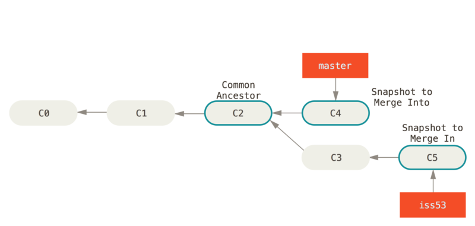
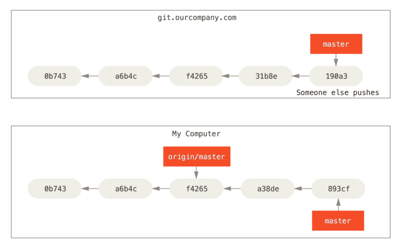

# Git分支

Git分支和远程分支一起看待或许比较好一点，远程分支的操作很大程度上依赖于本地分支的建立，两者可以同时考虑。

其实最重要的一点就是理解，分支本身并不特殊，Git中重要的是**对象校验和**，基本所有的内容都是围绕校验和展开的。

​	**分支就是指向对象校验和的指针。**


[TOC]


## 分支简介

在详细介绍分支之前，先回顾一下最开始的Git是如何保证完整性的。

​	Git通过对象校验和保证快照的完整性，三种对象（blob、tree、commit ）。

1. 暂存操作会为每一个文件计算校验和，然后会把当前版本的文件快照保存到 Git 仓库中（Git 使用 **blob 对象**来保存它们）。
2. 当执行提交动作时，Git会计算每一个子目录的校验和，然后在 Git 仓库中这些校验和保存为**树对象**。
3. 随后，Git 便会创建一个**提交对象**，它除了包含上面提到的那些信息外，还包含指向这个树对象（项目根目录）的指针。

所以，只要我们做出任何的改变，那么一定会有不同的提交，也就是快照。


我们为什么需要分支呢？

​	事实上如果你的项目类似原子操作，那本身也不需要什么管理了。项目在开发的过程中，会有一些比较重要的阶段，比如说一个项目当前是稳定的，但是我要做出不稳定的修改，那么实际上就有两个分支——稳定状态的提交、不稳定提交。我们可以在知晓一个稳定分支的基础上，对当前修改执行放心的大胆的操作，或者是让一个项目走向不同的分叉路。


**Git 的分支，其实本质上仅仅是指向提交对象的可变指针**。默认分支是`master`。在多次提交操作之后，你其实已经有一个指向最后那个提交对象的 `master` 分支。 它会在每次的提交操作中自动向前移动。


​														*分支提交及其历史*


### 分支创建

创建一个分支很简单，实际上就相当于创建一个执行提交对象的指针对象。我们用`git branch <branch_name>`创建新分支

```
$ git branch testing
```

这会在当前提交对象上创建一个分支


​														*两个指向相同提交的分支*


Git还有一个特殊的`HEAD`指针，用来指向当前所在的分支。


​														*HEAD 指向当前master分支*


### 分支切换

切换到一个已有分支可以采用`git checkout <branch_name>`，`git switch <branch_name>`。比如切换到`testing`分支

```
$ git checkout testing
```

这样 `HEAD` 就指向 `testing` 分支了。


​														*HEAD 指向当前所在的分支*


分支的目的就是这么简单，现在如果我们进行了一些操作

```
$ vim test.rb
$ git commit -a -m 'made a change'
```

那么`testing`（更应该说`HEAD`指向的分支就会指向最新提交）


​														*HEAD 分支随着提交操作自动向前移动*


我们可以继续在当前分支上执行操作，继续更新`testing`指针，我们也可以切换回`master`分支，然后做一些修改

```
$ git checkout master
$ vim test.rb
$ git commit -a -m 'made other changes'
```

现在我们的项目的提交历史已经产生了分叉（不同的提交对象有相同的父提交对象）


​														*项目分叉历史*

我们可以采用`git log --oneline --decorate --graph --all` ，它会输出你的提交历史、各个分支的指向以及项目的分支分叉情况。


## 分支的新建与合并

我们目前已经学会了如何新建分支，如何切换分支，这两个操作是可以合在一起的。

```
$ git checkout -b iss53
Switched to a new branch "iss53"
```

上述操作等价于

```
$ git branch iss53
$ git checkout iss53
```


### 分支的合并

#### 直接上游的合并

如果当前项目的状态如下


那么如果要将`hotfix`分支合并到`master`，可以在`master`分支下使用`git merge <branch_name>`

```
$ git checkout master
Switched to branch 'master'
$ git merge hotfix
Updating f42c576..3a0874c
Fast-forward
 index.html | 2 ++
 1 file changed, 2 insertions(+)
```

在合并的时候，注意到"快进（fast-forward）"这个词。 由于当前 `master` 分支所指向的提交是你当前提交（有关 hotfix 的提交）的直接上游，所以 Git 只是简单的将指针向前移动。


#### 三方合并

如果状态如下



要将`iss53`分支合并到`master`，我们还是在`master`分支下执行 `git merge <branch_name>`

```
$ git checkout master
Switched to branch 'master'
$ git merge iss53
Merge made by the 'recursive' strategy.
index.html |    1 +
1 file changed, 1 insertion(+)
```

注意到这次的分支并不是直接的上游合并，在这种情况下，你的开发历史从一个更早的地方开始分叉开来（diverged）。因为，`master` 分支所在提交并不是 `iss53` 分支所在提交的直接祖先，Git 不得不做一些额外的工作。 出现这种情况的时候，Git 会使用**两个分支的末端所指的快照**（`C4` 和 `C5`）以及这两个分支的**工作祖先**（`C2`），做一个简单的**三方合并**。


和之前将分支指针向前推进所不同的是，Git 将此次三方合并的结果做了一个**新的快照**并且自动创建一个新的提交指向它。 这个被称作一次合并提交，它的特别之处在于他有不止一个父提交。


​														*一个合并提交*


如果你不需要`iss53`分支了，可以使用 `git branch -d <branch_name>`删除

```
$ git branch -d iss53
```


#### 遇到冲突的合并

如果你在合并的时候，两个分支对同一个文件的同一部分做了不同的修改，Git 就没法干净的合并它们。在合并它们的时候就会产生合并冲突：

```
$ git merge iss53
Auto-merging index.html
CONFLICT (content): Merge conflict in index.html
Automatic merge failed; fix conflicts and then commit the result.
```

比如这个分支合并就涉及到了`index.html`的合并冲突

此时你可以手动修改冲突文件，如果你打开`index.html`，内容类似下面`# 本文档标注，忽略`

```t
<<<<<<< HEAD:index.html
<div id="footer">contact : email.support@github.com</div>
======= # 分割线，上面是 当前分支的冲突区域，下面是 要合并分支的冲突区域
<div id="footer">
 please contact us at support@github.com
</div>
>>>>>>> iss53:index.html
```

你可以对这个文件做出修改，然后提交。


## 分支管理

### 查看合并分支

可以使用`git branch -vv`查看每一个分支的最有一次提交

```
$ git branch -v
  iss53   93b412c fix javascript issue
* master  7a98805 Merge branch 'iss53'
  testing 782fd34 add scott to the author list in the readmes
```

可以采用 `git branch --merged`查看当前已经合并到当前分支的分支

```
$ git branch --merged
  iss53
* master
```

采用 `git branch --no-merged`查看没有合并到当前分支的分支

```
$ git branch --no-merged
  testing
```


## 远程分支

### 远程仓库

程仓库是指托管在因特网或其他网络中的你的项目的版本库。 你可以有好几个远程仓库，通常有些仓库对你只读，有些则可以读写。 与他人协作涉及管理远程仓库以及根据需要推送或拉取数据。 管理远程仓库包括了解如何添加远程仓库、移除无效的远程仓库、管理不同的远程分支并定义它们是否被跟踪等等。

#### 查看远程仓库

如果你的项目是克隆来的，那么你可以通过`git remote`直接查看远程仓库，默认是 `origin`

```
$ git clone https://github.com/schacon/ticgit
Cloning into 'ticgit'...
remote: Reusing existing pack: 1857, done.
remote: Total 1857 (delta 0), reused 0 (delta 0)
Receiving objects: 100% (1857/1857), 374.35 KiB | 268.00 KiB/s, done.
Resolving deltas: 100% (772/772), done.
Checking connectivity... done.
$ cd ticgit
$ git remote
origin
```

你也可以指定选项 `-v`，会显示需要读写远程仓库使用的 Git 保存的简写与其对应的 URL。

```console
$ git remote -v
origin	https://github.com/schacon/ticgit (fetch)
origin	https://github.com/schacon/ticgit (push)
```


#### 添加远程仓库

 运行 `git remote add <shortname> <url>` 添加一个新的远程 Git 仓库，同时指定一个你可以轻松引用的简写：

```
$ git remote
origin
$ git remote add pb https://github.com/paulboone/ticgit
$ git remote -v
origin	https://github.com/schacon/ticgit (fetch)
origin	https://github.com/schacon/ticgit (push)
pb	https://github.com/paulboone/ticgit (fetch)
pb	https://github.com/paulboone/ticgit (push)
```

现在你可以采用`pb`来代替整个`url`


#### 从远程仓库抓取与拉取

从远程仓库获取数据，运行 `git fetch <remote_name>`

```
$ git fetch pb
remote: Counting objects: 43, done.
remote: Compressing objects: 100% (36/36), done.
remote: Total 43 (delta 10), reused 31 (delta 5)
Unpacking objects: 100% (43/43), done.
From https://github.com/paulboone/ticgit
 * [new branch]      master     -> pb/master
 * [new branch]      ticgit     -> pb/ticgit
```

也可以采用`git pull`命令来自动抓取然后合并远程分支到当前分支（也有其他办法）


#### 推送到远程仓库

运行 `git push <remote_name> <branch_name>`可以将当前分支推送到远程服务器上

```
$ git push origin master
```


#### 查看远程仓库

如果想要查看某一个远程仓库的更多信息，可以使用 `git remote show <remote-name>` 命令

```console
$ git remote show origin
* remote origin
  Fetch URL: https://github.com/schacon/ticgit
  Push  URL: https://github.com/schacon/ticgit
  HEAD branch: master
  Remote branches:
    master                               tracked
    dev-branch                           tracked
  Local branch configured for 'git pull':
    master merges with remote master
  Local ref configured for 'git push':
    master pushes to master (up to date)
```


#### 远程仓库的移除与重命名

如果想要重命名引用的名字可以运行 `git remote rename <src_name> <target_name>` 去修改一个远程仓库的简写名。 

```
$ git remote rename pb paul
$ git remote
origin
paul
```

移除远程仓库可以运行 `git remote rm <remote_name>`

```
$ git remote rm paul
$ git remote
origin
```


### 远程分支管理

远程引用是对远程仓库的引用（指针），包括分支、标签等等。 可以通过 `git ls-remote (remote_name)`来显式获取远程引用的完整列表，或者是通过 `git remote show (remote_name)`来获取更为详细的信息。

```
PS D:\WorkSpace_IDEA\field_training_tasks\WithPlay> git ls-remote origin
c92eb8923664c4e9adcb42c32ef886d5ca4308b6        HEAD               # 远程引用的HEAD指针,(default repository)
c92eb8923664c4e9adcb42c32ef886d5ca4308b6        refs/heads/master  # 远程引用的分支(master)

PS D:\WorkSpace_IDEA\field_training_tasks\WithPlay> git remote show origin
* remote origin
  Fetch URL: git@github.com:parsley8026/with-play.git
  Push  URL: git@github.com:parsley8026/with-play.git
  HEAD branch: master
  Remote branch:
    master tracked
  Local branch configured for 'git pull':
    master merges with remote master
  Local ref configured for 'git push':
    master pushes to master (fast-forwardable)
```

从上面的命令行输出可以看出远程仓库只有一个分支`master`。并且已经被跟踪。


远程跟踪分支是远程分支状态的引用。 它们是你不能移动的本地引用，当你做任何网络通信操作时，它们会自动移动。 远程跟踪分支像是你上次连接到远程仓库时，那些分支所处状态的书签。

远程分支的命名有 `(remote_name)/(branch_name)`组成，比如上面就有一个 `origin/master`的远程分支。远程分支与本地分支不同，我们无法直接切换到远程分支去操作，但是可以查看远程分支，并在本地对其执行一些修改操作。

我们可以在本地看到远程的最新提交（其实和本地分支也差不多）

```
PS D:\WorkSpace_IDEA\field_training_tasks\WithPlay> git log --all --decorate --graph --oneline
* 21e372b (origin/master) Update README.md
| * a3274f2 (HEAD -> master) untrace target
|/
*   c92eb89 Merge remote-tracking branch 'refs/remotes/origin/master'
|\
| * e51fc58 Create README.md
* | 7753c01 modify .gitignore
* | 5d1019d add .idea
|/
* 9900cb2 first commit WithPlay
```


#### 远程分支本地查看

如果我们一开始使用的是克隆一个项目，那么本地分支`master`有和远程分支一致的最新提交对象


​														*克隆之后的服务器与本地仓库*

这时我们在本地`master`分支执行一些操作，然而在同一时间，其他人推送提交到 `git.ourcompany.com` 并更新了它的 `master` 分支，那么你的提交历史将向不同的方向前进。 也许，只要你不与 origin 服务器连接，你的 `origin/master` 指针就不会移动。



​														*本地与远程的工作可以分叉*


如果要同步你的工作，运行 `git fetch origin` 命令。 这个命令查找 “origin” 是哪一个服务器（在本例中，它是 `git.ourcompany.com`），从中抓取本地没有的数据，并且更新本地数据库，移动 `origin/master` 指针指向新的、更新后的位置。


​														`git fetch` *更新你的远程仓库引用*


#### 推送

我们可以推送一个分支到远程仓库，以便与他人协同工作，或者是版本管理。运行`git push (remote_name) (branch_name)`:

```
PS D:\WorkSpace_IDEA\field_training_tasks\WithPlay> git branch ba

PS D:\WorkSpace_IDEA\field_training_tasks\WithPlay> git branch -a
  ba
* master
  remotes/origin/master
  
PS D:\WorkSpace_IDEA\field_training_tasks\WithPlay> git push origin ba  # push 新的分支到远程仓库
Enumerating objects: 5, done.
Counting objects: 100% (5/5), done.
Delta compression using up to 8 threads
Compressing objects: 100% (3/3), done.
Writing objects: 100% (3/3), 327 bytes | 327.00 KiB/s, done.
Total 3 (delta 2), reused 0 (delta 0), pack-reused 0
remote: Resolving deltas: 100% (2/2), completed with 2 local objects.
remote:
remote: Create a pull request for 'ba' on GitHub by visiting:
remote:      https://github.com/parsley8026/with-play/pull/new/ba
remote:
To github.com:parsley8026/with-play.git
 * [new branch]      ba -> ba
```

这时，远程仓库的分支引用也会发生变化

```
PS D:\WorkSpace_IDEA\field_training_tasks\WithPlay> git ls-remote origin
21e372b416d97f288e63178a011b3000ad562550        HEAD
a3274f20134dd8a8dda44a0e93b0df9b95a250b2        refs/heads/ba
21e372b416d97f288e63178a011b3000ad562550        refs/heads/master
```


#### 跟踪分支

从一个远程跟踪分支检出一个本地分支会自动创建一个叫做 “跟踪分支”（有时候也叫做 “上游分支”）。 跟踪分支是与远程分支有直接关系的本地分支。 如果在一个跟踪分支上输入 `git pull`，Git 能自动地识别去哪个服务器上抓取、合并到哪个分支。

当克隆一个仓库时，它通常会自动地创建一个跟踪 `origin/master` 的 `master` 分支。当然也可以手动创建跟踪分支，运行 `git checkout -b [branch] [remotename]/[branch]`。 这是一个十分常用的操作所以 Git 提供了 `--track` 快捷方式：

```
$ git checkout --track origin/serverfix
Branch serverfix set up to track remote branch serverfix from origin.
Switched to a new branch 'serverfix'
```

不过如果我们的本地分支已经存在，然后又想跟踪一个远程分支，那么可以执行`git branch -u <remote_name>/<branch_name>`

```
PS D:\WorkSpace_IDEA\field_training_tasks\WithPlay> git branch -u origin/ba
branch 'ba' set up to track 'origin/ba'.

PS D:\WorkSpace_IDEA\field_training_tasks\WithPlay> git branch -vv
* ba     a3274f2 [origin/ba] untrace target
  master a3274f2 [origin/master: ahead 1, behind 1] untrace target
```

上面的 `git branch -vv`指令是查看具体的本地分支跟踪远程分支的情况，当然这只是对最后一次拉取的远程分支的比较


#### 拉取

当 `git fetch` 命令从服务器上抓取本地没有的数据时，它并不会修改工作目录中的内容。 它只会获取数据然后让你自己合并。

然而，有一个命令叫作 `git pull` 在大多数情况下它的含义是一个 `git fetch` 紧接着一个 `git merge` 命令。


#### 删除远程分支

`git push <remote_name> -d <branch_name>` 

```
PS D:\WorkSpace_IDEA\field_training_tasks\WithPlay> git push origin -d ba
To github.com:parsley8026/with-play.git
 - [deleted]         ba
```


